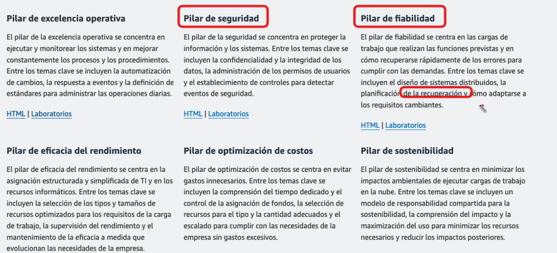

# AWS arquitectura correctamente diseñada. 

## Principios generales de diseño. 

**```Deje de adivinar las necesidades de capacidad:```**
Escalar hacia arriba o hacia abajo automaticamente. (No pensar en cuanto necesito todo el tiempo.)

**```Pruebe los sistemas a escala de producción```**
Hacer simulaciones reales cortas. La arquitectura la podre poner exactamente en producción a la misma escala. 

**```Automatizar```** Todas las acciones que se nos permita automatizar en aws debemos optar por este modelo de trabajo. Seguimiento para luego automatizar. No tener trabajo manual. 

**```Arquitecturas evolutivas```** Es decir, probar nuevas herramientas/servicios/recursos , permite hacer pruebas introducir mejoras, innovar. Que crezca de una forma rapida. 

**```Impulzar arquitectura usando datos```** Tomar desiciones basadas en datos reales del sistema que ya se tienen. 

**```Simulación de errores para probar la arquitectura```** La arquitectura debe serr resiliente , deberia simular ese tipo de favor, simular errores para que el diseño sea correcto o no y mejorarlo. (Sin necesidad de tumbar el sistema pero si verificar). 


## Pilares de arquitectura. 

1. Exelencia operativa
2. Seguridad (Datos / seguridad)
3. Fiabilidad (Alta disponibilidad / confianza de los datos / confiable)
4. Eficacia de rendimiento (Al realizar cmabios y poner en producción ver la excelencia del rendimiento)
5. Optimización de precios
6. Sostenibilidad: Ser conciente de los recursos que se están usando. 



(OJO)
### Diferencia entre: 

1. **Exelencia operativa:** Continuamente mejorar procesos / automatizar cambios lo maximo posible / reacción a eventos.

2. **Eficacia de rendimiento:** Estructura de los recursos de TI que ya tenemos y supervición del rendimiento. Recursos adecuados para la funcionalidad y a las necesidades especificas de la empresa  