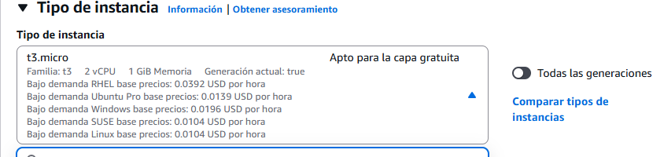
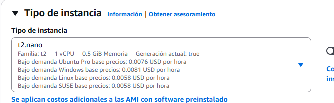

En este caso la opción correcta es **AWS - CloudTrail.** 

Monitorea: Acciones de Usuarios desde cualquier interfaz.

1. Como se uso determinado recurso. No las metricas ni los valores de uso. Que se hizo con el serivicio y desde donde.  Como nos dice llamada desde la api refuerza esta opción. 

Alertas basadas en alarmas cuando se usa AWS CloudWatch 

Podemos deteminar por la naturaleza

B) AWS CloudTrail / C) AWS Trsuted Advidsor. Son otro tipo de herramientas del nivel de AWS CloudWatch y diferentes a esta , la pregunta dice : **Alertas basadas en alarmas de AWS CloudWatch** Por lo tanto damos por descontado estas dos ocpiones. 

Similarmente con D) Amazon Route S3. hace referencia a servicios de S3. No especifica contexto directo con la pregunta por lo taanto descartada. 

Unicamente la A tiene validez. 

