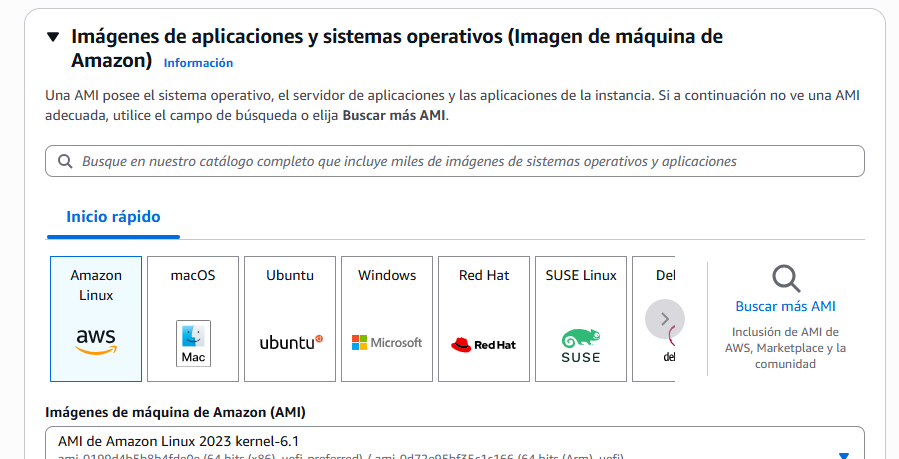

## CAPTURAS PREGUNTAS TIPO EXAMEN

a. Como se facturen los costos no implica economía. 
b y c. hacen implicaciones de **funcionalidad y beneficios opetativos** , pero no se relaciona con la pregunta de beneficio económico , una cosa puede o no, implicar la otra. 

c. **Correcta** ES obvio que cuando escalamos bajo demanda, y cuando es necesario, LAS CARGAS DE TRABAJO, pueden implicar variabilidad y economia de costos a diferencia de un sistema tradicional donde siempre se debe garantizar un nùmero alto de recursos permanente para estar preparados a la demanda. 

On premise implica obligatoriamente un costo de harware. Por lo tanto no es nada raro que al migrar a AWS el costo se reduzca. Las demás se enfocan en procesos que se mantienen inneherentes (c y d) en costos y procedimiento no se puede evitar. Y la B hace referencia a un servició especifico que no da contexto de lo que vamos a migrar. 
