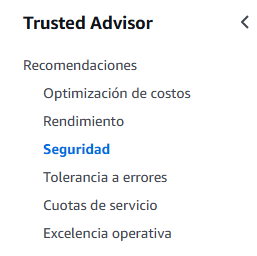
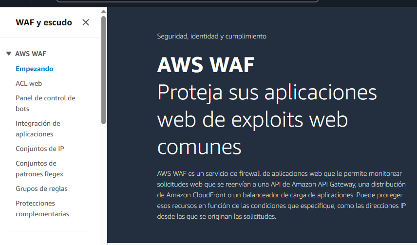

# **AWS Trusted Advisor y WAF.** 

# **Donde encontrar mas documentación y recursos acerca de la seguridad.**

Podemos entrar a la web de amazxon y entrar a **``Documentación``** 

La documentación es extensa y bajando por todas las secciones vamos a encontrar **``AWS security documentatión``** así entramos a toda la documentación referente a la seguridad y además existen accesos directos donde se encontrarán mas información. Ejm: Recursos de seguridad. ( Todo se deivide por secciones y servicios.)

## **AWS Trusted Advisor**
Agente que asesora ayuda para revisar como tenemos configurados los servicios en los  campos de:

- Seguridad 
- Facturación 
- Rendimiento

Depende de un **``plan de soporte que tenemos contratada``** ( Más o menos caracteristicas) En el gratuito ofrece pricipalment. Temas básicos de seguridad y **línites de uso de recursos**. Si se requiere algo adicional podemos obtener un **plan de soporte enterprise** mas robusto. 

## WAF 
Firewall para aplicaciones web (Bloquea o permite peticiones que tienen que ver con el protocolo http.) Dependiendo de los datos , de donde proviene x de los encabezados , de las direcciones que se están intentando acceder. Para prevenir ataques típicos. Tambien tiene en cuenta costes. 

# **AWS Trusted Advisor**
Buscando el servcio: **Trusted Advisor** podemos acceder a el panel que nos da , recomnedaciones de seguridad, rendimiento, seguridad coutas de servicio, tolerancia al servicio. 

Nos pide adquirir un plan de soporte. ( Para optimización de recursos / rendimiento). Nos ofrece eso si de manera gratuita opciones en seguridad.  Por ejemplo: 

Opciones que puedes utilizar con AWS Trusted Advisor. 

## **aws waf 

Opciones ofrecidas. 

