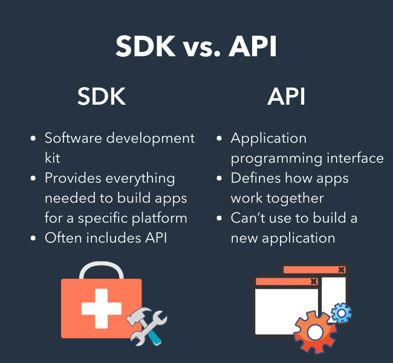
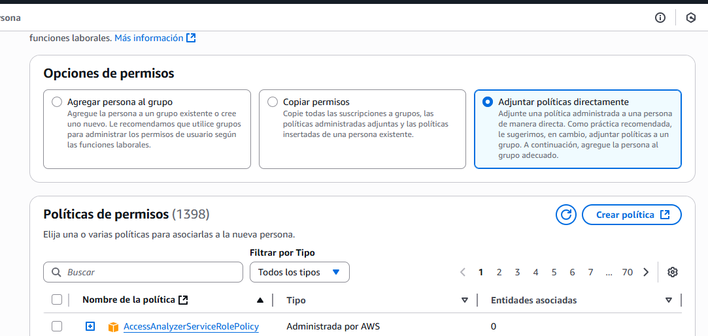
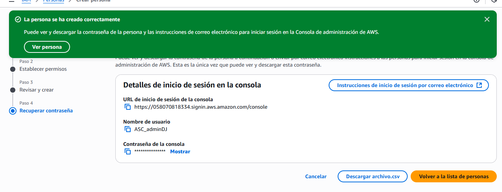

# Modos  de acceso de un usuario IAM

Puede acceder de dos formas. 

Acceso mediante programación:
1.  Se autentica con un ID de clave de acceso,
2. Una clave de acceso secreta 

Los terminales utilizan un interprete de comandos , un sdk va a utilizar los servicios de aws. 

 (Hablar de un api y de un sdk)

Cuando creo la cuenta **root** Ingreso usuario y contraseña esta opción no es la mas conveniente. Es mejor utilizar un **usuario iam** via web. 

Este se autentica por medio de un ID de cuenta o un alias de 12 dígitos, Además de un usuario IAM y una Contraseña IAM. Ya tiene 3 elementos.

- Nombre de usuario IAM
- Contraseña IAM
- ID de cuenta : Alias de 12 dígitos.
- Se puede utilizar el MFA (factor de autenticación multiple). (Fundamental que se hace con la cuenta **root**
)

## Segurizar cuenta raiz ( Para no utilizarla habitualmente )
1. Utilizar el factor de autenticación (root)

Podemos ir a la parte de credneciales de mi cuenta. Dentro podemos modificar la seguridad de mi cuenta / Establecer requisitos mas fuertes para la definición de contraseñas. 

### **Creación de ususario IAM (reemplaza la cuenta root)**

- Buscamos **IAM** o podemos entrar despleagando el perfil por credenciales de seguridad. Y creamos un usuario **IAM** Accedemos a ``Personas`` y ``crear_persona`` 
Podemos darle un nombre y asignarle acceso a la consola de AWS. 

- Otorgamos permisos (Puedo crear un grupo de administradores => Grupo) O puedo administrar permisos directamente ya que solo es una persona. 

 Podemos darle la politica de acceso de administrador. 

## **Iniciar session con esta cuenta**

Podemos ver que genera una url especifica , desde donde se puede identificar, y podemos volver a acceder a esto desde el panel de IAM. Aquí podemos ver nuevamente el  id de la cuenta , y la url de acceso que podemos tener como credencial y podemos cambiar según sea necesario  Podemos crearle un alias a la Dirreción y será mas facil de recordar la url.

Podemos usar ahora esta url para acceder directamente a este espacio. O podemos autenticarnos utilizando los 3 parámetros definidos (ID ACCESO / USUARIO / Contraseña)