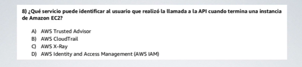
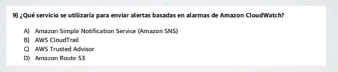
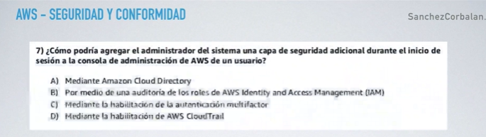
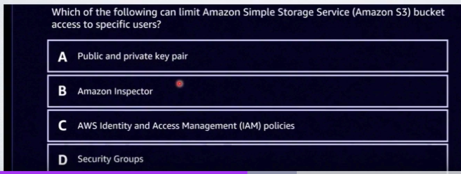

En este caso la opción correcta es **AWS - CloudTrail.** 

Monitorea: Acciones de Usuarios desde cualquier interfaz.

1. Como se uso determinado recurso. No las metricas ni los valores de uso. Que se hizo con el serivicio y desde donde.  Como nos dice llamada desde la api refuerza esta opción. 

---

Alertas basadas en alarmas cuando se usa AWS CloudWatch 

Podemos deteminar por la naturaleza

B) AWS CloudTrail / C) AWS Trsuted Advidsor. Son otro tipo de herramientas del nivel de AWS CloudWatch y diferentes a esta , la pregunta dice : **Alertas basadas en alarmas de AWS CloudWatch** Por lo tanto damos por descontado estas dos ocpiones. 

Similarmente con D) Amazon Route S3. hace referencia a servicios de S3. No especifica contexto directo con la pregunta por lo taanto descartada. 

Unicamente la A tiene validez. 

---

c) Mediante la HABILITACION de autenticación multifactor al inicio de la sessión. ?  (**Correcta ?**)

Sospechosa por qué la autenticación multifactor se puede aplicar a gran escala a todos los usuarios considerando que soy el **Administrador** en principio deberia ser de esta forma. Puede habilitarla

A) **Amazon Cloud Directory.** (Posible ya que al incluir en el drectorio activo se agrega capa de seguridad para los usuarios de la organización. ) Pero lo descartaria porque no es desde el inicio de sessión habla es del directorio activo. Servicio para controlar los colaboradores si hacen parte pero no desde inco de sessión Todavia C es mejor. **CLOUD DIRECTORY NO ENTRA EN LA CERTIFICACIÓN**

D) **AWS CloudTrail.** Nada que ver cumple es función de auditoria, quien hace que , sobre que servicio y como. Que pasa directamente con los recursos de aws tipo historial. No tiene que ver con autenticación en inicio de sesión (Incorrecta)

B) **Auditoria de ROLES**: AWS Identity / AWS Acces Managgment. 

No relacionado porque los roles se acogen a una Politica de IAM, pero no tienen que ver esepecificamente con directamente el inicio de la sesión sino de que permisos tiene esta "Entidad" Usuario/Servicio/SDK para trabajar. 

Respuesta final **C Mediante autenticación multifactor al inicio de la sessión**.

--- 

Cual de los siguientes puede límitar el acceso a un bucked de S3 a **Usuarios especificos**

A) Public and Private Key: No tiene que ver en este caso una llave publica y una privada hace parte de los protocolos SSL TLS , HTTP, si tiene que ver con seguridad pero más con el cifrado, transporte de datos que pueden utilizarlas. No limita "usuarios especificos" en si. **Incorrecta**

B) Amazon Inspector. Ya vimos que es un servicio para la seguridad de servicios en especifico, pued quizas revisar aluna configuración emiitr alertas No lo hace de forma dinámica, no lo hace por medio de la revisión de logs. Sin embargo entiendo que trata de **``encontrar vulnerabilidades como apoyo a administración de nuestors sistemas``** Punto clave. No limita en si tampoco acceso a usuarios especificos. 

C) AWS Identity y AWS Managment ``**politicies IAM**``. 

Por medio de una politica si puedo limitar el acceso a un recurso de S3. Ouedo establecer una politica para que solo un grupo de usuarios tenga acceso al Bucked de S3. Muy viable esta respuesta. Por que la política me establece acciones por ejemplo para un grupo. **Si puede establecer limitaciones la politica por eso es esto lo que hace límita y se aplica a grupos / usuarios / roles.**

D) Security Groups. (En este momento no se ha visto pero es claro que la C es demasiado aplastante.)
