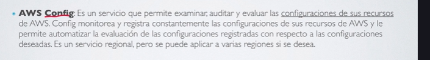
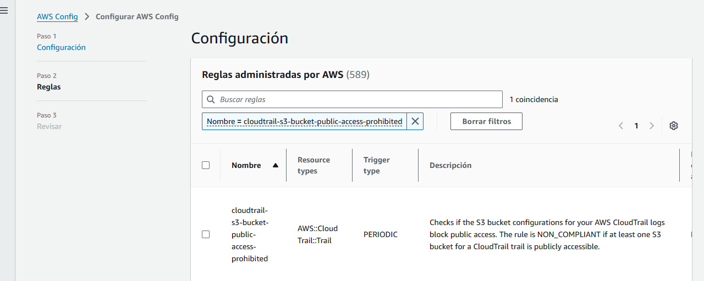
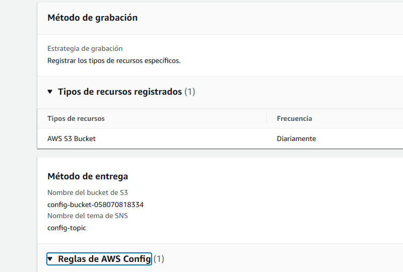

# AWS Config. 

Permite auditar y evaluar en tiempo real **LOS CAMBIOS QUE ESTAMOS HACIENDO EN LAS CONFIGURACIONES DE NUESTROS SERVICIOS**

Permite revisar las condiciones de configuración de nuestros recursos.

- Audita 
- Evalua 
- Compara (Configuraciones actuales con Configuraciones Deseadas que hayamos programado.) y lanza alertas de NO conformidad si las ``configuraciones actuales`` se desvian de las ``configuraciones deseadas``

Configuraciones Deseadas: Depoende de las condiciones y de regulacion también de la región, Un tema regional nos dice por las certificaciones que debe cumplir unas configuraciones (EEUU) y en Europa debe cumplir otra diferente. Por lo tanto este servicio funciona de forma Regional. 

Podemos ir al panel para ver si todo es correcto **``AWS Config``**

Notemos al consultar en el panel ``AWS Config != AWS appConfig``

Se divide en Reglas y Recursos. 

Ejmplo: **Se crean 2 bucked de S3**. Y tenemos una regla de que todos los bucked de S3 van a tener que ser de acceso privado. Por lo que podemos configurar esta regla de  acceso: 

Quiero comprobar que en todos mis S3-bucked no sean publicos entonces aquí creé esta regla. 

Podemos ver la revisión: 

