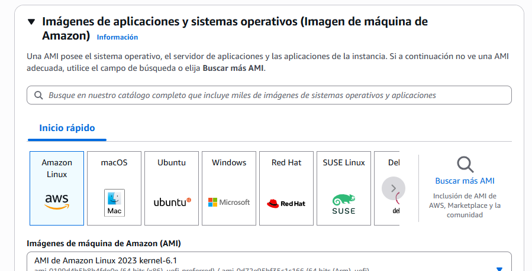
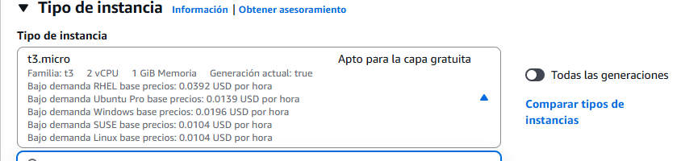
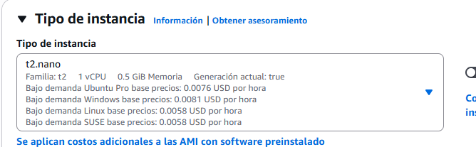

# EC2 

Entramos a aws y buscamos EC2 directo dentro del panel. 

Podemos ver dentro del panel de la instancia que se configuran por defecto los grupos de seguridad. Y un resumen de todas las caracteristicas, recursos  mencionadas anteriormente.

Instancias en ejecución / Grupos de ubicación / Balanceadores de carga  actualmente configurados etc. 

## lANZAMIENTO DE LA INSTANCIA

Podemos escoger el nombre de la instnacia y agregarle una etiqueta. 

## Eleccción del sistema operativo.  (Eleccion del AIM)

Podemos escoger entre gran variedad y la versión del mismo, Buscar adicionales si es necesario , Existe un marketplace / y AMI hechas por la comunidad. Algunas tiene costo hay que tener en cuenta. Se puede elegir la versión y el kernell aptas para capa gratuita y cuales no. 

## Eleccion del tipo de instancia (Recursos hardware virtualizado)

Podemos ver las opciones. 

La nomenclatura nos dice lo siguiente: 

Primer letra hace referencia al tipo para el cual está pensado y el numero a la versión. De menor a mayor potencia la palabra asociada

Ejemplo: 

**``t2 - nano < t3 - micro < t2 - small``** Si las medimos por sus capacidades. 

Podeos ver (3) es la geenración actual. 

nano nos ofrece en este caso (0.5 gb de memoria ram / 1 CPU), depende del sistema operativo selecionado tiene su precio. También tiene el tipo de ram especifica que queremos y podemos comparar las instnacias entre si. 

Para obtener infoirmación adiconal sobre las instancias podemos ir a EC2 menu superior del panel y revisar la opción "Tipo de instnacia", Ahí podremos ver muchos tipos de instancia con diferentes optimizaciones según el caso. 

## Creamos el par de claves privada publica. 

Escogemos el tipo de clave , y podemos descargar un archivo con las mismas

## Configuración de Red 

Creamos un grupo de seguridad. Reglas básicas a que se puede acceder la instancia a que servicios, como se va a usar , configurar 

Podemos dejar por defecto que la conexión sea ssh , que se permita el trafico paraconextar a la instnacia. 

Por el momento dejamos acceso desde cualquier lugar , pero tambien puedo configurar solo mi ip. o crear una personalizada. 

**¿Que es mi IP?**

Esa IP identifica tu red como origen de conexión, no el servidor. (Cuando hablamos de mi "ip")
🔐 Si configuras tu instancia EC2 con “My IP” (la IP de tu casa):

Entonces AWS crea una regla de seguridad (Security Group) que solo permite conexiones desde esa IP específica — la IP pública que tienes en ese momento (la de tu red doméstica).

Por tanto:

🔸 Si luego intentas conectarte desde otra red (por ejemplo, tu trabajo, una cafetería o tu celular), no podrás acceder a la instancia.
AWS bloqueará la conexión porque la nueva IP no coincide con la que está autorizada.

Nota: Esta ip hace referencia a la ip de mi red / no a la de mi pc. 

## Configuración de almacenamiento

Lo que permite la capa gratuita EBS 30 GB 

💽 ¿Qué es EBS (Elastic Block Store)?

Amazon EBS significa Elastic Block Store, y es un servicio de almacenamiento en bloques que se conecta a tus instancias EC2.

🔹 Es como el disco duro persistente de una máquina virtual (EC2).
🔹 Permite leer/escribir datos en bloques, igual que un SSD físico.
🔹 Se mantiene aunque apagues o reinicies la instancia.

Obviamente tambien permite versatilidad en tamaño y tipo , es mas generico.  Alamacenamiento en bloques. 

## Detalles avanzados. 

lo mas importante selccionar un ROL especifico , asociarlo de una vez para no tener problemas de permisos. 

Y podemos lanzar esta instancia. 

En el panel de instancias podemos ver todo lo que hemos creado. 

