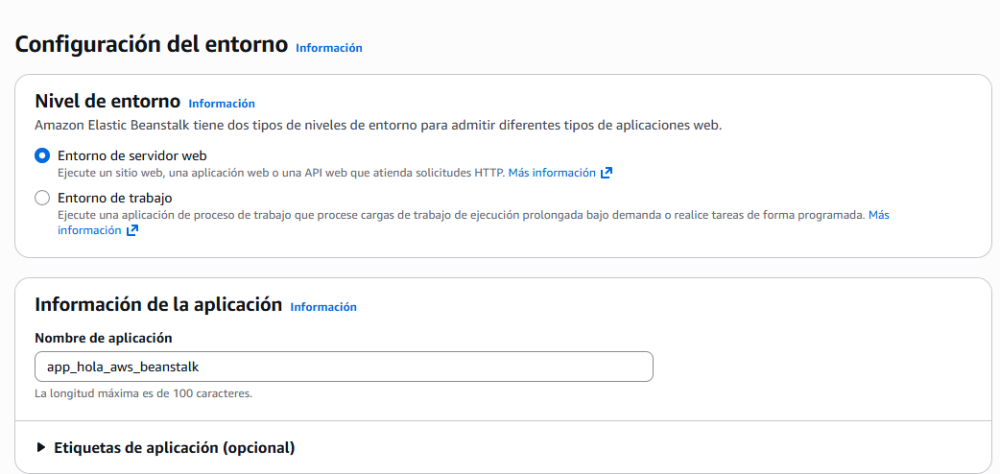
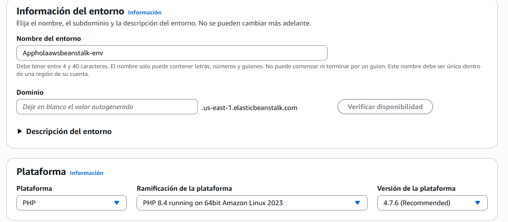

# AWS Lightsailt y Beanstalk. 

Serivicos de computación relacionados con aplicaciones web

# AWS  Elastic Beanstalk == Similar a PaaS. Platformn as a Service 

Ejemplo de platafortma como servicio, tnego mi código tengo mi desarollo, pero no me quiero preocupar por administrar el servidor , los plugings etc. 

# AWS Elastic Ligthsailt. (Además de lo anterior)

Ofrece una forma muy facil de instalar software: Por ejemplo de instalar wordpress de una manera exageradamente sencilla. 

---

# **Vamos a crear una aplicación con Beanstalk**

1. Cremaos aplicación hola mundo aplicaicon_hola_mundo.py

2. Comprimimos el archivo en zip. (Como es un simple hola mundo nmo necesita librerias ni nada)

3. Vamos a **AWS Beanstalk**

Luego escogemos lenguaje y escogemos la plataforma (lenguaje)

Notemos que se va a generar un entorno para correr la aplicación pasa automaticamente. 

Luego me va pedir configurar un rol (Podemos crear uno recordar que no tiene costo... (El rol en si.))

Si le doy esto a la instancia de EC2 

Debo asignar roles y permisos para la instancia de EC2 (En la certificación se crea todo de manera casi automatica , la politica de AWS ya me exige confirmar lo que quiero crear. )

Sin embargo puedo crearlo para ejecutar mi aplicación. (Proceso proxima vez. )

Retorna una URL con la aplicación. / Podemos actualizar la versión de la aplicación. / Puedo personalizar el entorno también.
---

### AWS Elastic Ligthsailt.

Más amigable , grafico me sirve para instalae una aplicación, todo es visible. (actualmnete aws no me permite el servicio usando la cuenta gratuita )

Puedo selecionar plataforma / puedo escoger lo que le quiero instalar (ejm wordpress) 
escogo un plan y se crea un espacio con los requerimientos y vere mi wordpress creado. 

Utilizando la ip publica puedo acceder al wordpress / puedo ver metricas / gestionar almacenamiento / red / dominios etc. 