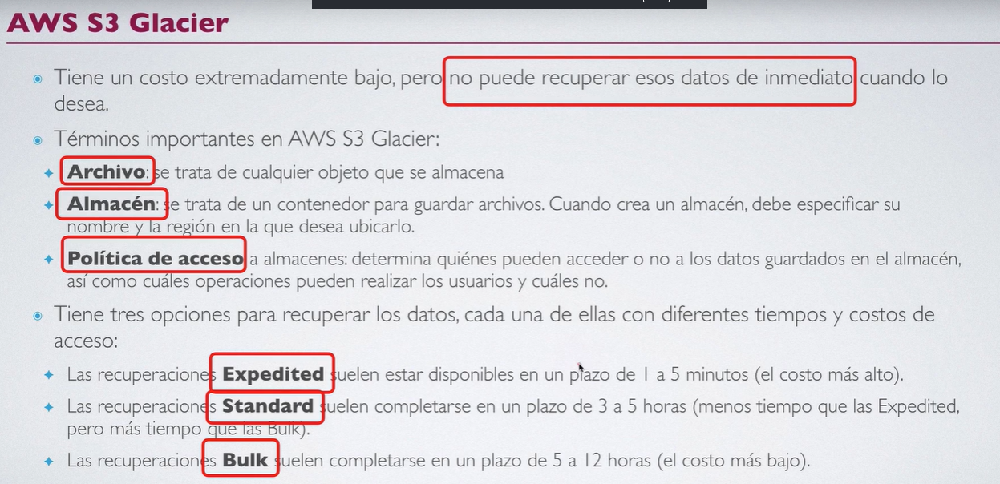

## AWS S3 glassier.

Opciones de almacenamiento: 

Parámetros principales para escoger un tipo de almacenamiento de S3.

1. ¿Que tan frecuentemente queremos acceder a los datos que tenemos en el almacenamiento?

2. ¿Que tan rapido necesitamos acceder a estos datos?

- S3 de proposito general. (S3 STANDAR)

## AWS S3 GLASSIER:  S3 SIA (STANDAR INFRECUENT ACCESS)
Datos de acceso infrecuente , alamacenamiento de videos o fotos que voy a recuperar de ves en cuando, o copias de seguridad muy estatica, que el sistema no hará muchas peticiones para cceder a estos objetos.

Si además los datos no son muy **importantes**  tenemos aquí 
## AWS S3 One Zone-Infreuent-Access. 

Datos que unicamente se guardan en una zona (sabemos que esto es más pequeño que una región.) Los datos se puede dar el caso de que **todos los centros de datos de la zona** caigan por alguna razón, es poco probable pero puede pasar, esto tiene replicación y disponibilidad pero solo dentro de esta zona.

## AWS S3 Glassier  ( Muy economico / los datos no se pueden recuperar de manera inmediata / al objeto se le denomina archivo.)
Estamos hablando de datos, a los que será poco probable tener la necesidad de acceder a ellos a corto , medio plazo. Se trata de datos como historiales médicos de pacientes que ya no estan , pero que por legislación se deben conservar muchos años. expendientes de alumnos historicos en universidad. Datos que se almacenan para un caso extraordinario. 

- AWS S3 Glassier:  Se divide en 3 tipod dependiendo de la velocidad a la que necesite recuperar estos datos. 

    1. Los necesito inmediatamente. Entonces: **AWS S3 Glassier Instant Retrieval**

    2. Los necesito no tan inmediatamente flexible (Horas). Entonces: **AWS S3 Glassier Instant Retrieval**

    3. Los necesito no con premura tan urgente (12 - 48 horas ) recuperación planificada. **AWS S3 Glassier Deep Archive**

Lo normal es que yo tenga cierta politica y tenga este tipo de almacenamiento con una condiciones, al pasar por ejemplo el tiempo se transfieren los datos de un almacenamiento a otro. **Tambien existe una gestión inteligente de los datos** El sistema mira que tanto accedo a esos datos y puede sugerir moverlos a una u otra parte según la necesidad. 

Conceptos clave: 

OJO EN **GLASSIER HABLAMOS DE ALMACEN NO DE BUCKED DE S3**
